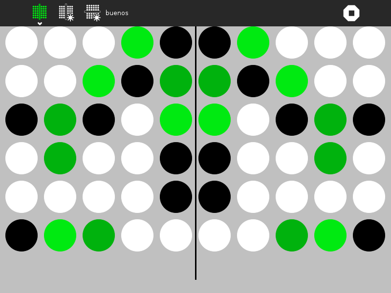

Reflection Activity 
===============

Reflection is a game designed around reflective symmetry. The user modifies an image until it has reflective symmetry around either the horizontal or vertical axis.

How to use?
===============
Reflection is not a part of Sugar Desktop but can be added. Refer to the following links-

* [How to Get Sugar on sugarlabs.org](https://sugarlabs.org/), 
* [How to use Sugar](https://help.sugarlabs.org/), and;
* [How to use Reflection](https://wiki.sugarlabs.org/go/Activities/Reflection) 

How to upgrade?
===============
On Sugar Desktop systems;

* [Use My Settings,](https://help.sugarlabs.org/my_settings.html) [Software Update](https://help.sugarlabs.org/my_settings.html#software-update) 
* [Use Browse to open ](https://activities.sugarlabs.org/)activities.sugarlabs.org Search for Reflection, then download

